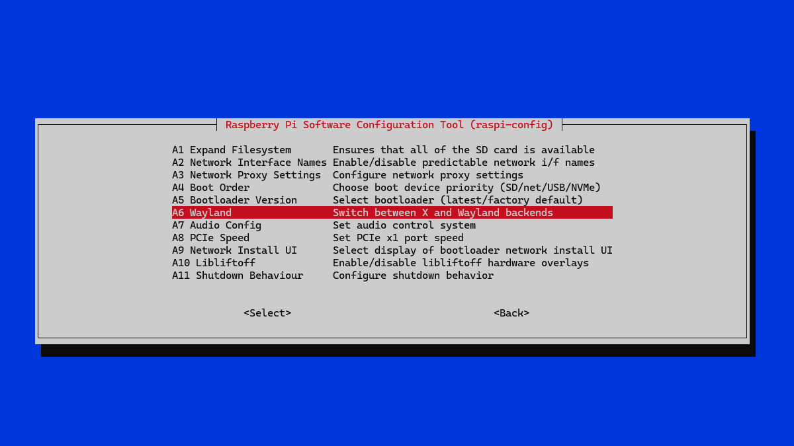

# Rasperberry Pi Command & Control

## Switch On / Off Screensaver

**Aufgabenstellung:** Den Bildschirmschoner scriptgesteuert ein/-ausschalten können.<br />
**Problem:** Standardmäßig ist bei dem aktuellen Raspberry Pi OS Wayland konfiguriert.
Für diesen gibt es aber (noch) keinen funktionierenden Bildschirmschoner.

- https://de.wikipedia.org/wiki/Wayland_(Display-Server-Protokoll)
- https://forums.raspberrypi.com/viewtopic.php?t=364310

Allerdings kann man den Raspberry umkonfigurieren das wieder X11 benutzt wird.


### Switch from Wayland To X11

```bash
sudo raspi-config
```




Danach ein `reboot`.

### Install XScreenSaver

```bash
sudo apt install xscreensaver
```

### Configure XScreenSaver


### Testscript

Ich habe ein kleines Testscript `ActivateAndDeactivateScreenSaver.sh` erzeugt:

```bash
#!/bin/bash

sleep 1
xscreensaver-command -activate

sleep 20
xscreensaver-command -deactivate
```

liegt auch unter `./test` :-) .

Nach starten des Scripts ( auf dem Raspberry ;-) ) wird nach einer Sekunde der Bildschirmschoner
aktiviert und nach 20 Sekunden wieder deaktiviert. Funktioniert also beides.

<!-- &#x21D2; -->

### API Service

- RestService with FastAPI
- CLI, GUI, HTML Page for testing purpose or adhoc control ?